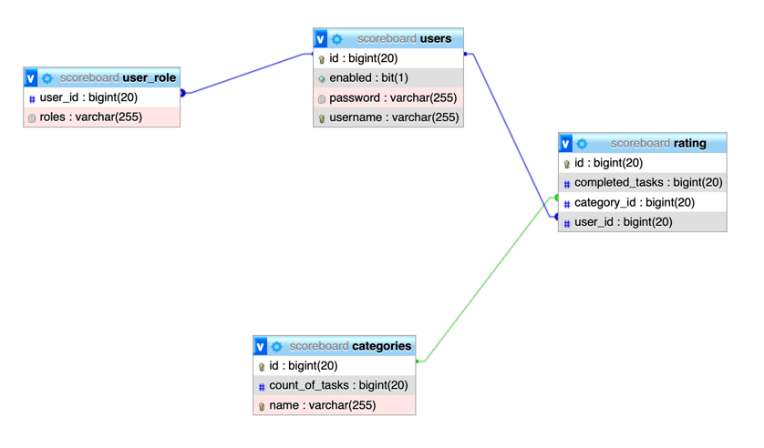

# Веб приложение для отслеживания прогресса сотрудников
Веб приложение разработано на языке Java с помощью фреймворка Spring. 
База данных задействованная в реализации веб приложения - MySQL.

### Возможности
- Авторизация с помощью логина и пароля
- Разграничение по ролям : обычный пользователь и администратор
- У администратор есть собственная панель администрирования
- Сайт доступен по адресу: http://5.181.109.239/

Внутри системы есть три пользоваетеля:

    Login    Password
    user     user    (Пользователь)
    user1    user1   (Пользователь)
    admin    admin   (Администратор)
Также в базе данных изначально есть три категории заданий и у каждого пользователя есть результаты
по этим категориям, из которых и строится рейтинг.
### **Архитектура приложения :**

Приложение разделено на контроллеры обрабатывающие запросы, сервисный слой (DAO) 
и слой обращения с базой данных

Авторизация и разграничение доступа по страницам выполнена при помощи Spring Security и настройки WebSecurityConfig,обращение
с базой данных выполнено при помощи интерфейсов наследующихся от CrudRepository, 
каждая таблица из БД представлена классом с аннотацией @Entity. Данные выводятся на 
фронт часть при помощи шаблонизатора Thymeleaf. 

Проект развернут при помощи Docker и работает на VPS сервере.

### Схема базы данных

